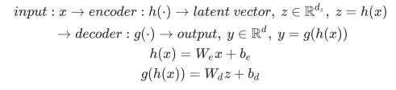
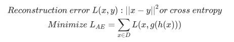

# tensorflow-autoencoder
autoencoder implemented with tensorflow

## Autoencoder

입력과 출력이 같은 구조인 네트워크이며, 보통 가운데 Node(encoder의 출력단)의 차원이 줄어드는 형태이다.

Sparse Autoencoder의 경우 실질적으로 차원 수가 올라가지만, Sparsity 제약조건으로 인해 실제적인 데이터의 차원이 줄어들었다고 보아도 무방하다. 이 Repository에서는 일반적인 Autoencoder만을 다룬다.

입력 데이터 x 로부터 출력값 y 까지의 과정은 아래와 같다.

모델의 최종 목표는 입력 데이터와, 모델의 복원값의 차이를 최소화 하는 것이다.

