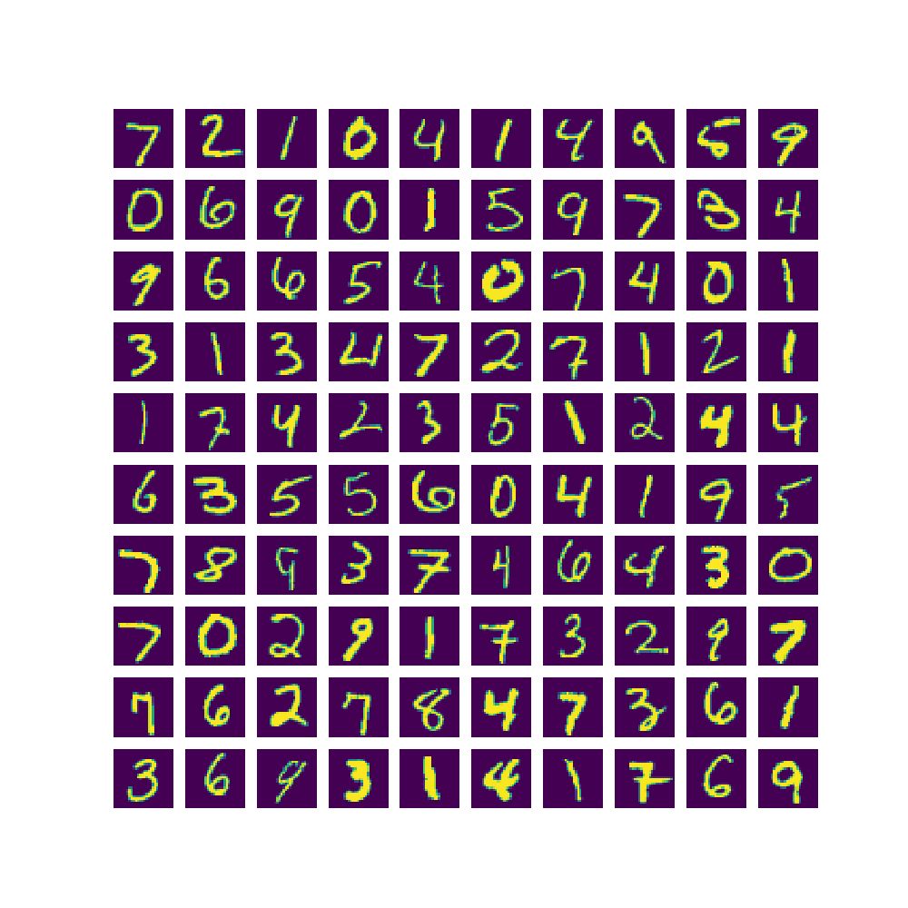
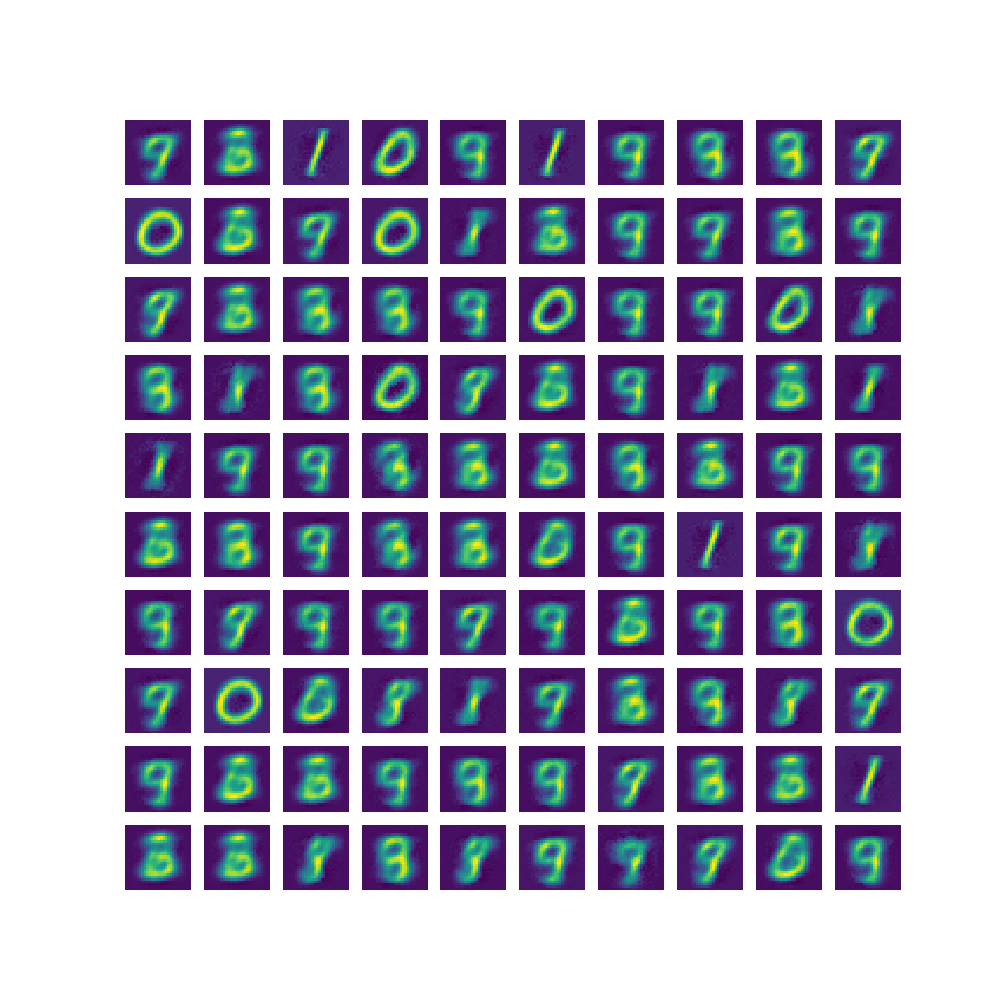

# tensorflow-autoencoder
autoencoder implemented with tensorflow

## Autoencoder

입력과 출력이 같은 구조인 네트워크이며, 보통 가운데 Node(encoder의 출력단)의 차원이 줄어드는 형태이다.

Sparse Autoencoder의 경우 실질적으로 차원 수가 올라가지만, Sparsity 제약조건으로 인해 실제적인 데이터의 차원이 줄어들었다고 보아도 무방하다. 이 Repository에서는 일반적인 Autoencoder만을 다룬다.

입력 데이터 x 로부터 출력값 y 까지의 과정은 아래와 같다.

모델의 최종 목표는 입력 데이터와, 모델의 복원값의 차이를 최소화 하는 것이다.

## Visualization

### Training

### Test

테스트 데이터 중, 원본 이미지

Encoder: x(784) -> hidden(128) -> hidden(64) -> hidden(32) -> hidden(16) -> hidden(8) -> z(2)

Decoder: z(2) -> hidden(8) -> hidden(16) -> hidden(32) -> hidden(64) -> hidden(128) -> x_hat(784)

위와 같은 네트워크 구조로 100 epoch 학습 후, Decoder가 복원한 이미지

`CNN`을 사용했다면 더욱 정확하게 복원되었겠지만, 일반적인 Fully-Connected 구조로 얼마나 2차원 공간에 Mapping이 가능한지 확인하는 정도로 구현하였다. Flat한 구조로는 1과 0은 대단히 잘 복원하지만, 비슷한 숫자끼리는 정확히 복원을 하기 어려움을 알 수 있다.